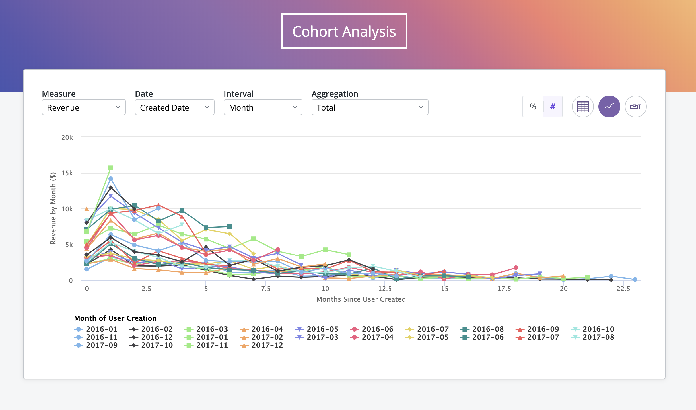

# cohort



## Installation

Add `thelook` via the instructions [here](https://github.com/looker/helltool#the-look-a-fictional-clothing-store). If already installed, make sure it is up to date with production.

Run `yarn start` to start serving extension. Add the following to a `manifest.lkml` file in Looker:

```
project_name: "cohort"

application: cohort {
  label: "Cohort Analysis"
  file: "bundle.js"
  # url: "http://localhost:8080/bundle.js"
  entitlements: {
    allow_forms: yes
    allow_same_origin: yes
    navigation: yes
    core_api_methods: ["create_query", "lookml_model_explore", "run_query"]
  }
}
```

Make sure the project you added the application to has a configured model.
